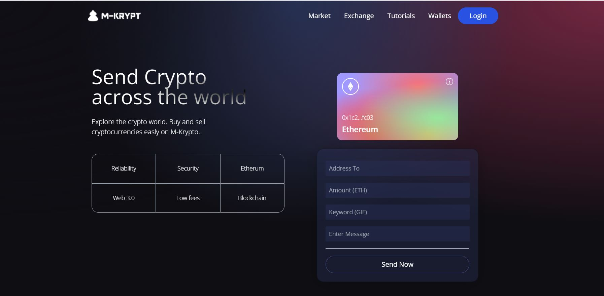

# Web-3.0-Blokchain-App-Client-Side

This is a web 3.0 blokchain app with smart contract in ethereum network. In this app, you can pair your metamask wallet and send ethereum to any ethereum wallet. After connecting your metamask wallet all the transaction history is displayed at the bottom section.

## Built With

- React
- Vite
- npm
- ES6
- Tailwind CSS

[Live Demo Link Netlify](https://m-krypt-blokchain-app.netlify.app/)

## Getting Started

To get a local copy and running follow these simple example steps.

### Setup

- Node js
- Clone the repo and cd in it.

### Install

- Run `npm install` in your terminal

### Usage

- Run `npm run dev` in your terminal

Runs the app in the development mode. 
Open [http://localhost:3000](http://localhost:3000) to view it in the browser.

### Tests

To run tests

- No tests yet

## Author

👤 **Samuel Teweldebrhan Ghebremeskel**

- Github: [@githubhandle](https://github.com/Samitti)
- Twitter: [@twitterhandle](https://twitter.com/Samuel63734232)
- Linkedin: [linkedin](https://www.linkedin.com/in/samuel-ghebremeskel-29685811a/)

## 🤝 Contributing

Contributions, issues and feature requests are welcome!

Feel free to check the [issues page](https://github.com/Samitti/Catalogue-Project-Redux/issues).

## Show your support

Give a ⭐️ if you like this project!
